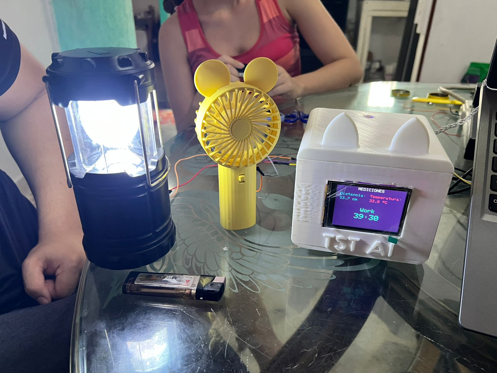
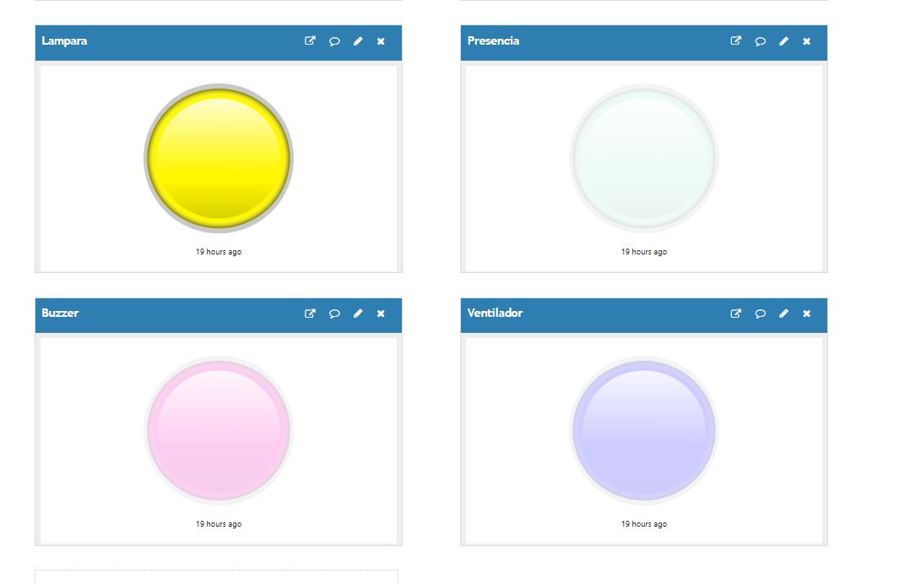
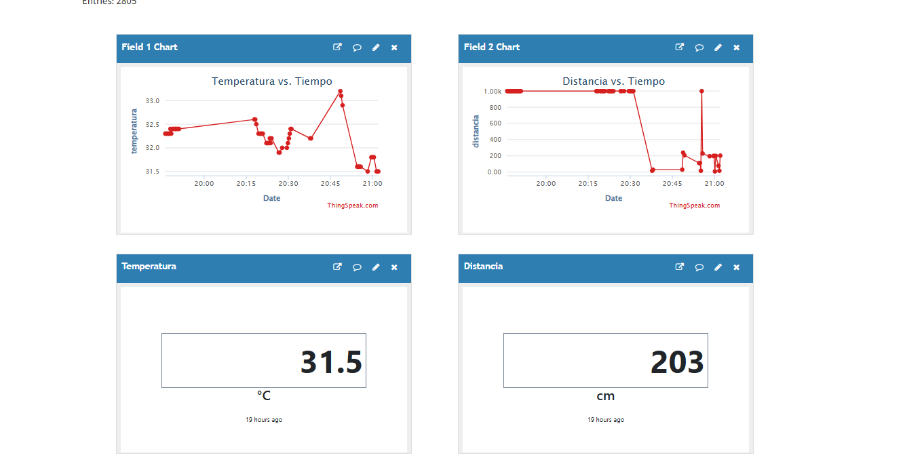
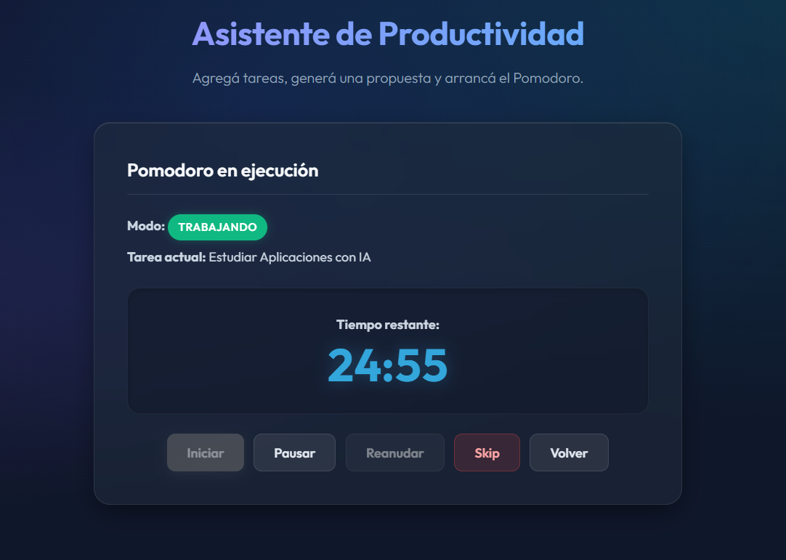
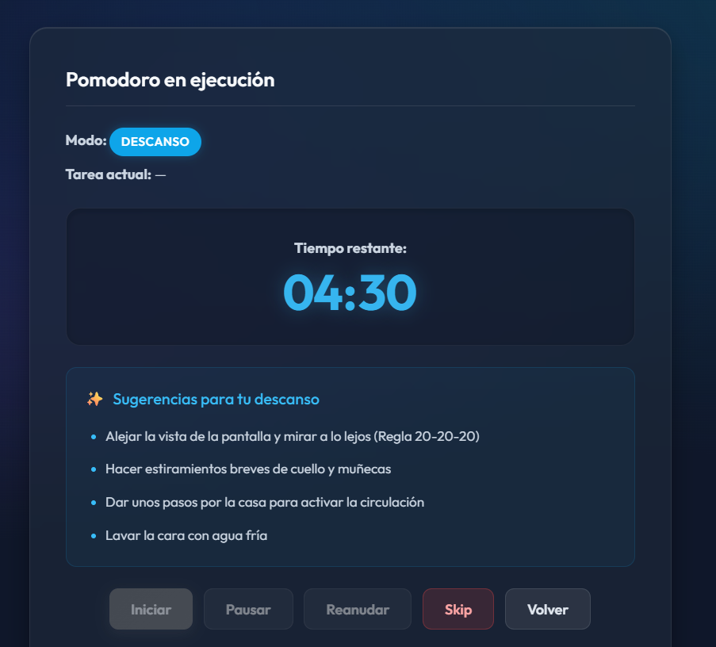
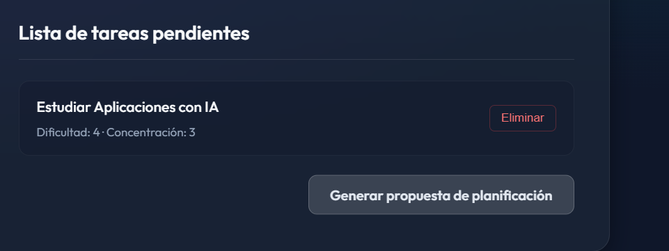
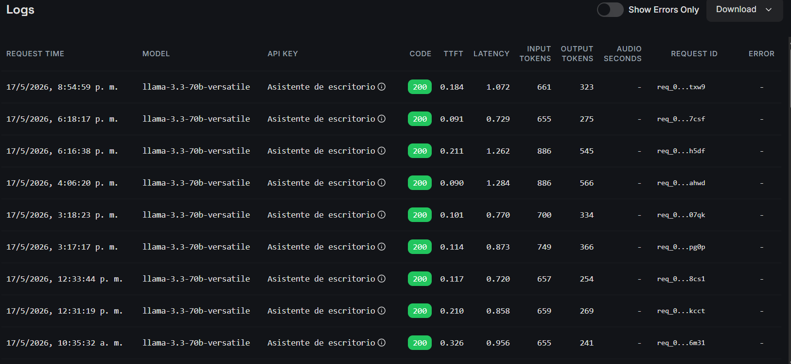
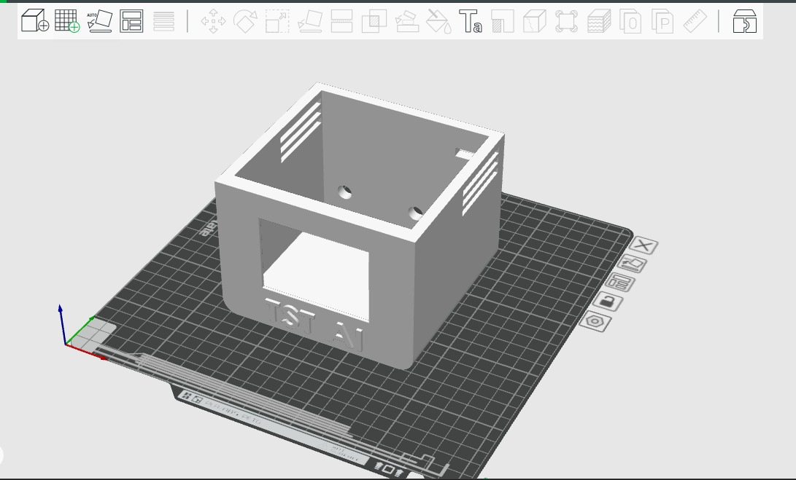
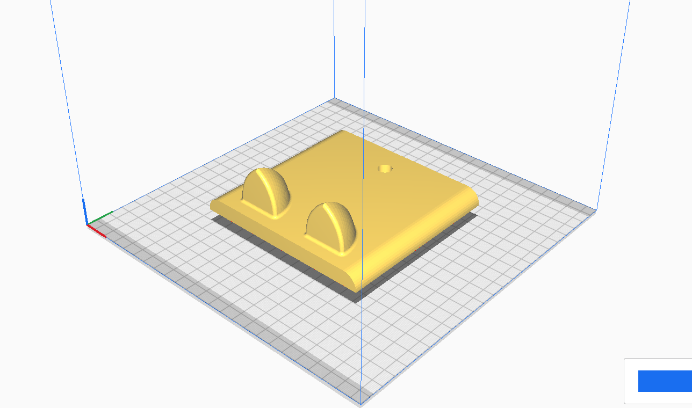

 # 🧠 TST AI – Smart Desktop Assistant with Pomodoro
### ESP32 • Flask • IoT • Artificial Intelligence • ThingSpeak • Productivity Assistant


---

# 📖 Descripción

**TST AI (Time Study Technology AI)** es un asistente inteligente de escritorio desarrollado para mejorar la productividad, la gestión del tiempo y las condiciones de confort durante el trabajo en computador.

El sistema integra:

- 🤖 Inteligencia Artificial mediante **Llama 3 70B 8192 (Groq API)**.
- ⏱️ Técnica **Pomodoro** para la organización inteligente del tiempo.
- 🌐 Arquitectura **IoT** basada en **ESP32**.
- ☁️ Monitoreo remoto utilizando **ThingSpeak**.
- 🖥️ Interfaz web desarrollada con **Flask**.
- 🌡️ Sensores y actuadores para mejorar las condiciones ergonómicas del usuario.

El usuario puede ingresar sus tareas diarias y el sistema genera automáticamente:

- Priorización de actividades.
- Propuestas de tiempo de trabajo y descanso.
- Recomendaciones de pausas activas personalizadas.
- Monitoreo ambiental en tiempo real.
- Alertas de proximidad al computador.
- Visualización de información en una pantalla TFT.

---

# 🎥 Video de funcionamiento

▶️ **Demostración completa del proyecto**

https://drive.google.com/file/d/1GQcZTR0kRA0mAZTCB3ue1ugdXq3iJFn3/view

---

# 📸 Galería del Proyecto

## Sistema en funcionamiento



## Dashboard de monitoreo en ThingSpeak





## Técnica Pomodoro

### Sesión de trabajo



### Tiempo de descanso



## Gestión de tareas



## Monitoreo de la API y registros



## Diseño e impresión 3D






---

# 🎯 Objetivo General

Desarrollar un asistente inteligente de escritorio basado en tecnologías IoT e Inteligencia Artificial que permita mejorar la productividad, la gestión del tiempo y las condiciones ergonómicas del usuario mediante la automatización de tareas, monitoreo ambiental y recomendaciones personalizadas utilizando la técnica Pomodoro.

---

# 🚀 Características Principales

## 🤖 Agente Inteligente

- Priorización automática de tareas.
- Generación de propuestas Pomodoro personalizadas.
- Recomendaciones de pausas activas.
- Respuestas estructuradas en formato JSON.
- Sistema de respaldo local ante fallos de la API de IA.

## ⏱️ Gestión Inteligente del Tiempo

- Técnica Pomodoro adaptativa.
- Tiempos de trabajo entre 15 y 45 minutos.
- Descansos entre 5 y 15 minutos.
- Organización automática según dificultad y nivel de concentración.

## 🌡️ Monitoreo Ambiental

- Medición de temperatura mediante DHT22.
- Detección de proximidad mediante HC-SR04.
- Visualización de información en tiempo real en pantalla TFT.

## 🔔 Automatización y Confort

- Encendido automático del ventilador.
- Encendido automático de la lámpara.
- Alertas sonoras por cercanía excesiva a la pantalla.
- Monitoreo remoto mediante ThingSpeak.

---

# 🏗️ Arquitectura General del Sistema

```text
                        ┌──────────────────┐
                        │      Usuario     │
                        └────────┬─────────┘
                                 │
                                 ▼
                    ┌─────────────────────┐
                    │  Interfaz Web Flask │
                    └────────┬────────────┘
                             │
          ┌──────────────────┼──────────────────┐
          │                  │                  │
          ▼                  ▼                  ▼
 ┌────────────────┐ ┌────────────────┐ ┌────────────────┐
 │ Agente IA      │ │ API REST       │ │ ThingSpeak     │
 │ Llama3 70B     │ │ Flask Backend  │ │ Cloud          │
 └────────────────┘ └────────┬───────┘ └────────────────┘
                             │
                             ▼
                      ┌─────────────┐
                      │    ESP32    │
                      └─────┬───────┘
                            │
      ┌──────────┬──────────┼──────────┬──────────┬──────────┐
      │          │          │          │          │          │
      ▼          ▼          ▼          ▼          ▼          ▼
   DHT22      HC-SR04      TFT      Buzzer   Ventilador   Lámpara
```

---

# ⚙️ Lógica del Sistema

| Condición Detectada | Acción Realizada |
|---------------------|------------------|
| Usuario entre 0 y 70 cm | Encendido de lámpara y ventilador |
| Distancia menor a 40 cm | Activación de buzzer |
| Temperatura superior a 30 °C | Encendido del ventilador |
| Usuario fuera del rango | Apagado del ventilador |
| Usuario fuera del rango durante 10 s | Apagado de la lámpara |

---

# 🛠️ Tecnologías Utilizadas

## Software

- Python
- Flask
- HTML5
- CSS3
- JavaScript
- C++
- Arduino IDE

## Inteligencia Artificial

- Groq API
- Llama 3 70B 8192
- Prompt Engineering
- JSON

## IoT y Comunicación

- ESP32
- APIs REST
- HTTP Requests
- ThingSpeak
- WiFi

---

# 🔌 Hardware Utilizado

| Componente | Función |
|------------|----------|
| ESP32 | Unidad de procesamiento principal |
| DHT22 | Medición de temperatura |
| HC-SR04 | Detección de distancia |
| Pantalla TFT LCD 2.8" | Visualización de información |
| Buzzer | Alertas sonoras |
| Ventilador | Control de confort térmico |
| Lámpara | Iluminación automática |
| MOSFET IRLZ44N | Etapa de potencia |
| Diodo 1N4007 | Protección contra picos de voltaje |

---

# 📌 Distribución de Pines

## Sensores y Actuadores

| Señal | Pin |
|-------|------|
| Trigger | GPIO 12 |
| Echo | GPIO 14 |
| Lámpara | GPIO 13 |
| Buzzer | GPIO 27 |
| Ventilador | GPIO 26 |
| DHT22 | GPIO 33 |

## Pantalla TFT

| Señal | Pin |
|-------|------|
| MOSI | GPIO 23 |
| SCK | GPIO 18 |
| CS | GPIO 21 |
| DC | GPIO 22 |
| RST | GPIO 19 |

---

# 🧠 Funcionamiento del Agente Inteligente

El agente inteligente utiliza el modelo:

**Llama 3 70B 8192 mediante la API de Groq.**

El proceso de funcionamiento es el siguiente:

1. El usuario ingresa una lista de tareas.
2. El sistema construye un prompt estructurado.
3. La IA analiza:

- Dificultad.
- Nivel de concentración.
- Prioridad.
- Tiempo requerido.

4. La IA genera:

- Tarea recomendada.
- Tiempo de trabajo.
- Tiempo de descanso.
- Actividades de recuperación.
- Explicación de la propuesta.

El sistema incorpora una **lógica local de respaldo**, permitiendo continuar el funcionamiento incluso si la API de IA no se encuentra disponible.

---

# ☁️ Integración IoT y Monitoreo en la Nube

La ESP32 envía información a ThingSpeak mediante solicitudes HTTP cada 10 segundos.

Las variables monitoreadas incluyen:

- Temperatura.
- Distancia detectada.
- Estado de la lámpara.
- Estado del ventilador.
- Estado del sistema.

Los datos son representados mediante gráficas en tiempo real para facilitar el análisis del entorno y del comportamiento del asistente inteligente.

---

# 📂 Estructura del Proyecto

```text
TST-AI
│
├── backend/
│   ├── routes/
│   ├── services/
│   ├── templates/
│   ├── static/
│   └── app.py
│
├── firmware/
│   ├── thecode.ino
│   ├── config.h
│   ├── sensores.cpp
│   ├── sensores.h
│   ├── actuadores.cpp
│   ├── actuadores.h
│   ├── pantalla.cpp
│   ├── pantalla.h
│   ├── wifi_manager.cpp
│   ├── wifi_manager.h
│   ├── flask_client.cpp
│   └── flask_client.h
│
├── docs/
│
├── images/
│
├── requirements.txt
├── README.md
└── .gitignore
```

---

# ⚙️ Instalación

## Clonar el repositorio

```bash
git clone https://github.com/TU_USUARIO/TST-AI.git
cd TST-AI
```

## Crear entorno virtual

### Windows

```bash
python -m venv .venv
.venv\Scripts\activate
```

### Linux/Mac

```bash
python3 -m venv .venv
source .venv/bin/activate
```

## Instalar dependencias

```bash
pip install -r requirements.txt
```

## Ejecutar el backend

```bash
python app.py
```

---

# 🎯 Resultados Alcanzados

✅ Integración completa entre Hardware y Software.

✅ Implementación de un sistema IoT funcional.

✅ Desarrollo de una API REST mediante Flask.

✅ Integración de un modelo de Inteligencia Artificial basado en LLM.

✅ Aplicación de la técnica Pomodoro de manera inteligente y personalizada.

✅ Monitoreo remoto mediante ThingSpeak.

✅ Diseño, modelado e impresión 3D de la carcasa del dispositivo.

✅ Desarrollo de un sistema modular y escalable.

---

# 🔮 Trabajo Futuro

- Aplicación móvil.
- Integración con Google Calendar.
- Historial de productividad mediante bases de datos.
- Dashboard estadístico avanzado.
- Modelos de Machine Learning para personalización de recomendaciones.
- Reconocimiento de voz.
- Integración con asistentes virtuales.

---

# 👥 Autores

### Tamara Valeria Escobar Andrade
**Ingeniería de Sistemas – CORHUILA**

- Investigación y fundamentación teórica.
- Diseño de la lógica del agente inteligente.
- Desarrollo conceptual de la planificación Pomodoro.
- Documentación técnica y redacción del informe.

### Santiago Rodríguez Bermeo
**Ingeniería de Sistemas – CORHUILA**

- Integración IoT.
- Telemetría y ThingSpeak.
- Validación y análisis de resultados.

### Thomas Trujillo Cerquera
**Ingeniería de Sistemas – CORHUILA**

- Diseño y ensamble del hardware.
- Electrónica de potencia.
- Integración de sensores y actuadores.

---

# 📄 Licencia

Este proyecto fue desarrollado con fines académicos y de investigación en la **Corporación Universitaria del Huila (CORHUILA)**.

© 2025 – TST AI (Time Study Technology AI)
